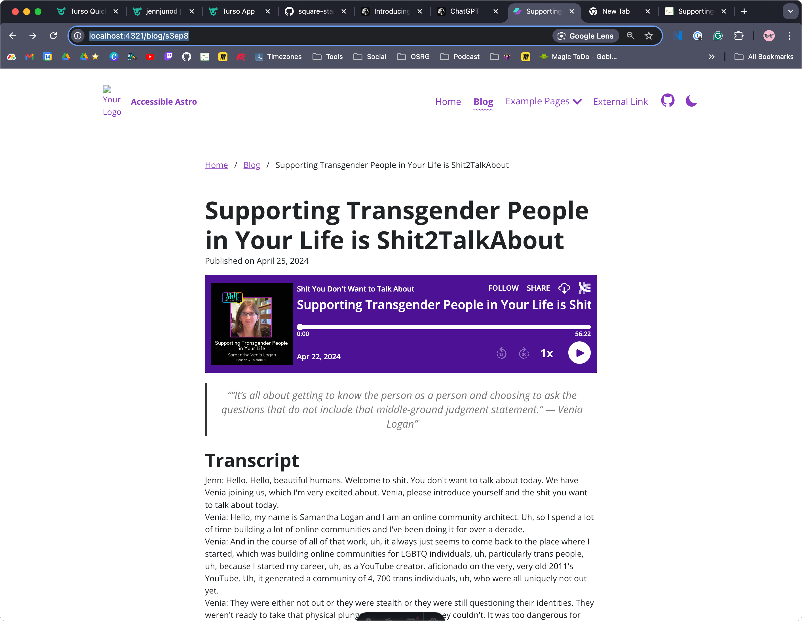
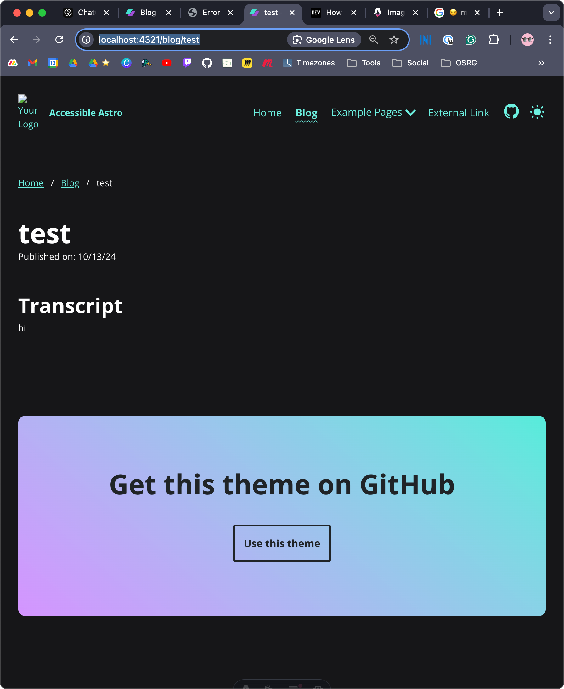

# Notes for myself for building
What better way than my readme 😏

### Next Steps

Figure out formatting

- [x ] figure out formatting
- [ ] import all data
- [ ] update homepage

### Done 10/14/24

### Done 10/13/24

Created turso database s2tadb with table posts

CREATE TABLE posts (
    id SERIAL PRIMARY KEY,
    title VARCHAR(255) NOT NULL,
    description TEXT NOT NULL,
    date DATE NOT NULL,
    quote TEXT,
    transcript TEXT,
    podcastEmbed TEXT
);

Was able to get the test page working http://localhost:4321/blog/test
Formatting isn't great
